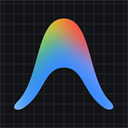

# Antigravity Browser Bridge 🚀

<div align="center">
  
  <p><strong>Полноценный AI-мост между Google Chrome и Antigravity IDE через протокол MCP</strong></p>

  [](https://github.com/cartmanlayneckurfxjo-creator/antigravity-browser-extension/releases)
  [](LICENSE)
  []()
</div>

---

**Antigravity Browser Bridge** превращает ваш браузер в интерактивный инструмент для AI-агентов в **Antigravity IDE**. 

В отличие от стандартных расширений, здесь нет сторонних платных API-ключей или вызовов в облако — браузер подключается по локальному WebSocket к собственному **MCP-серверу (Model Context Protocol)**, предоставляя агенту Antigravity полный доступ к управлению вкладками, извлечению данных, анализу страниц и навигации.

---

## ✨ Возможности

### 🌐 Для пользователя (в браузере):
- **Официальный интерфейс Side Panel:** боковая панель с индикатором статуса соединения с IDE в реальном времени.
- **📥 Захват контекста (Capture Context):** сбор DOM-структуры, заголовков, форм и текста страницы в один клик.
- **📸 Скриншоты (Screenshot):** мгновенный снимок видимой области активной вкладки.
- **📝 Умное саммари (Summarize Page):** автоматическая очистка страницы от баннеров, скриптов и навигации с генерацией ключевых тезисов.
- **🎯 Интерактивный инспектор (Pick Element):** наведение курсора подсвечивает любой элемент в браузере, клик рассчитывает уникальный CSS-селектор и **копирует его в буфер обмена**.
- **🎬 Извлечение субтитров YouTube (YT Transcript):** автоматический сбор полного транскрипта любого видео с таймкодами без ручных действий.
- **🖱️ Контекстное меню (ПКМ):**
  - Выделил текст -> *«🚀 Отправить в Antigravity IDE»*
  - Клик по странице -> *«📝 Сделать саммари этой страницы»*

### 🤖 Для AI-агента (через MCP Tools):
| Инструмент | Описание |
|---|---|
| `browser_get_context` | Чтение полного DOM-дерева, форм, ссылок, текста и метатегов активной страницы |
| `browser_navigate` | Переход по указанному URL с ожиданием загрузки вкладки |
| `browser_click` | Клик по элементу через CSS-селектор или видимый текст |
| `browser_type` | Ввод текста в поля ввода и текстовые области с триггером событий |
| `browser_screenshot` | Снятие скриншота в формате PNG и передача в контекст агента |
| `browser_get_tabs` | Получение списка всех открытых вкладок браузера |
| `browser_switch_tab` | Переключение активной вкладки по номеру или названию |
| `browser_scroll` | Скролл страницы (вверх, вниз, в конец или к указанному селектору) |
| `browser_get_element` | Детальный инспектор элемента (bounding box, атрибуты, текст, класс) |
| `browser_get_youtube_transcript` | Автоматическая выгрузка полного текста субтитров YouTube с таймкодами |
| `browser_pick_element` | Запуск интерактивного режима выбора элемента пользователем |
| `browser_get_article` | Извлечение очищенного текста статьи/страницы без мусора |

---

## 🏗 Архитектура

Система построена на отказоустойчивой клиент-серверной архитектуре:

1. **Chrome Extension (Manifest V3):**
   - Service Worker (`background.js`) с поддержкой Keep-Alive и контекстного меню.
   - Content Script (`content.js`) для манипуляций с DOM и интерактивного инспектора.
   - UI Side Panel (`sidepanel.html` / `sidepanel.js`).
2. **MCP Bridge Server (`mcp-server/server.js`):**
   - **Master/Relay протокол:** если открыто несколько окон Antigravity IDE или несколько процессов language server, первый процесс становится WebSocket-мастером на порту `7842`, а остальные подключаются к нему как Relay-клиенты. **Исключены любые ошибки `EADDRINUSE`.**
   - Полная поддержка стандарта Model Context Protocol (MCP) через `stdio`.
3. **Antigravity IDE:**
   - Подключается к серверу через `mcp_config.json`.

---

## ⚙️ Установка и настройка

### 1. Установка расширения в Chrome
1. Скачайте архив `antigravity-browser-extension-v0.2.0.zip` из [Releases](https://github.com/cartmanlayneckurfxjo-creator/antigravity-browser-extension/releases) и распакуйте его (или клонируйте репозиторий).
2. Откройте в Chrome страницу `chrome://extensions/`.
3. Включите **«Режим разработчика»** (Developer mode) в правом верхнем углу.
4. Нажмите **«Загрузить распакованное расширение»** (Load unpacked) и выберите папку `extension`.

### 2. Подключение к Antigravity IDE
Добавьте сервер в глобальный конфигурационный файл `~/.gemini/config/mcp_config.json`:

```json
{
  "mcpServers": {
    "antigravity-browser": {
      "command": "node",
      "args": [
        "C:/Users/USERNAME/.../antigravity-browser-extension/mcp-server/server.js"
      ]
    }
  }
}
```

Перезагрузите окно IDE (`Ctrl+Shift+P` -> `Developer: Reload Window`).

### 3. Автономный запуск (опционально)
Если нужно запустить WebSocket-мост отдельно без IDE:
```bash
cd mcp-server
npm install
npm run ws-only
```

---

## 📄 Лицензия
MIT License © 2026 Antigravity Contributors
